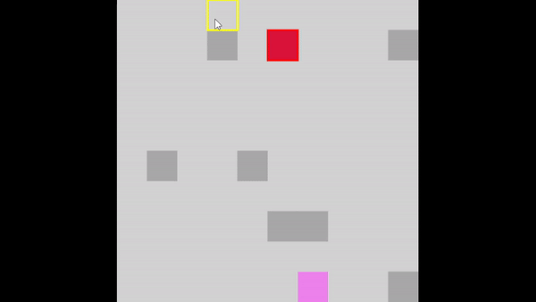
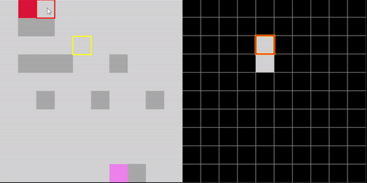

# Saé3.02 : Chasse au Monstre

Le monstre évolue dans un labyrinthe, une grille découpée en cases, avec lequel le chasseur interagit sans pour autant s’y situer.

Le monstre **connaît l’entrée** et **la sortie** et a une connaissance partielle ou totale des obstacles du labyrinthe.

Dans un premier temps, on peut supposer qu’un labyrinthe est une grille carrée avec des obstacles (mais ce n’est pas très important, ça pourrait être une grille rectangulaire, une île aux formes mal définies, un tore, pourquoi pas des étages, des pièges, des passages secrets, ...)  et que **le monstre connaît l’emplacement des obstacles**.

Les **obstacles** occupent une case du labyrinthe qui **ne peut être traversée**. Dans un second temps, on pourra supposer que le monstre a une connaissance limitée à quelques cases autours de lui et à la sortie.

Pour cette version des règles, le monstre ne pourra pas trouver un chemin à l’avance dans le labyrinthe mais devra y progresser à l’aveugle, en étant parfois obligé de rebrousser chemin. Le chasseur connaît la forme et la dimension de la grille, mais il ne connaît rien d’autre : ni l’emplacement de l’entrée ou de la sortie, ni l’emplacement des obstacles.

Le **but du jeu** pour le chasseur est de **trouver le monstre**, pour le monstre de **réussir à atteindre la sortie du labyrinthe** depuis l’entrée sans se faire attraper par le chasseur. Un tour de jeu consiste en **un coup du monstre suivi d’un coup du chasseur**.

## Démarrer l'application

PLUS TARD

Il faudra ouvrir un terminal, se déplacer dans le dossier application et entrer cette commande :

```bash
java --module-path ./javafx-sdk-11.0.2/lib/ --add-modules javafx.controls,javafx.fxml -jar MonsterHunt.jar
```

ou vous pouvez aussi la démarrer en cliquant sur le fichier launch.sh.

## Utilisations

Lorsque le jeu se lance vous atterissez sur le **menu principal**, depuis vous pouvez choisir le **nom des joueurs** pour chacun des deux rôles ainsi que de choisir si **l'un des joueurs ou les deux joueurs soit/sont un/des IA avec leur niveau de difficulté**. Vous avez aussi la possibilité de **personnaliser votre expérience** de jeu en allant de le menu ***"modify settings"***, ici vous pourrez modifier les **paramètres du jeu** tel que choisir de jouer en écran partagé ou scindé**, choisir la **taille du labyrinthe**, définir un **taux d'apparition des murs** ou encore un **thème pour le jeu**.

Pour jouer il suffit d'appuyer sur le bouton ***"PLAY"***, le jeu se lance alors, pour **sélectionner une case du labyrinthe** il suffit d'appuyer sur **clic gauche**, pour **tirer (pour le chasseur) / se déplacer (pour le monstre)** il suffit de **maintenir** la touche ***"SHIFT"*** puis de **sélectionner** la case voulue. 


## Documentation

Vous pouvez retrouvez **toute la [documentation](doc/index.html)** (javadoc) en cliquant **[ici](doc/index.html)** ou sur docuementation.

## Screenshots

### Diffèrent mode de jouer :

Exemple de partie en **écran partagé** (sameScreen) : 




Exemple de partie en **écran scindé** (separateScreen) :



### Thèmes :

***Thème Forêt*** : 


***Thème Océan*** :


## Auteurs

Fourmaintraux Camille - camille.fourmaintraux.etu@univ-lille.fr  
Arthur Debacq - arthur.debacq.etu@univ-lille.fr  
Jessy Top - jessy.top.etu@univ-lille.fr  
Théo Franos - theo.franos.etu@univ-lille.fr  
